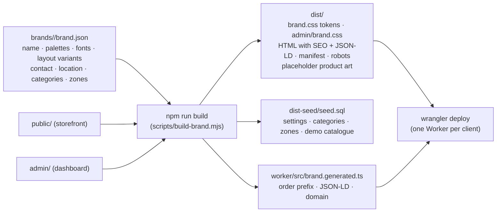

# Brand pipeline: reuse this build for other clients

This codebase is a **white-label clothing store**. Everything brand-specific lives in one file:
`brands/<client-id>/brand.json`. The build script turns it into a themed site, admin, SEO metadata, PWA manifest, placeholder art and seed data. Each client gets their own look and brand guidelines while all clients share the same tested code.



## What a brand controls

| Area | `brand.json` key | Effect |
|---|---|---|
| Identity | `name.en/bn`, `shortName`, `tagline`, `description`, `logo.monogram` | Header, footer, titles, OG tags, JSON-LD, PWA name, generated SVG icon and OG image |
| Colours | `palettes.<id>` (16 tokens each), `activePalette` | `dist/brand.css` CSS variables used everywhere (`--c-primary`, `--c-accent`, `--c-motif-a`…) |
| Typography | `design.fonts.display/body/googleFontsQuery` | Google Fonts link and `--font-display` / `--font-body` |
| **Layout variants** | `design.heroStyle`: `arch` · `split` · `fullbleed` | Hero composition |
| | `design.motif`: `taant` (woven stripe) · `stitch` (kantha running-stitch) · `none` | Section dividers and card hover band |
| | `design.cardStyle`: `arch` · `square` | Product/category image shape |
| | `design.radius`, `buttonShape` (`pill`/`square`/`rounded`), `density` (`comfortable`/`compact`) | Corner radius, button shape, spacing scale |
| Admin theme | `admin.primary/primaryDeep/pink/bg` | Neumorphic admin colours and gradient |
| Business | `orderPrefix` (2–5 capitals), `domain`, `locale.default` | Order numbers (`LKS-260924-7KQM`), canonical URLs, default language |
| Contact & location | `contact`, `location` (street/city/region EN+BN, lat/lng, map embed), `social` | Footer, About page, invoices, LocalBusiness JSON-LD |
| Seed data | `seed.categories` (nested), `seed.deliveryZones`, `seed.demoProducts` | Starting catalogue structure and delivery-fee tiers |

The build **validates** the file: required keys, all 16 palette tokens, and order-prefix format. It stops with a clear error if something is missing.

## Onboarding a new client (about 30 minutes)

1. **Copy the template**
   ```bash
   cp -r brands/_template brands/rupkotha
   ```
2. **Edit `brands/rupkotha/brand.json`** from the client's brand guidelines. Set the name, tagline, logo monogram, hex colours, fonts, layout variants, contact, address and map, categories and delivery zones. You can put several palettes in one file for the client to compare.
3. **Preview locally**
   ```bash
   BRAND=rupkotha npm run build
   npm run db:migrate:local && npx wrangler d1 execute DB --local --file=dist-seed/seed.sql
   npx wrangler dev
   # compare palettes:
   BRAND=rupkotha PALETTE=night-bloom npm run build
   ```
4. **Create the client's Cloudflare resources** (their own account or yours): D1, KV and R2, as in `docs/SETUP.md`. Give the Worker a unique `name` for each client, e.g. `wrangler deploy --name rupkotha-store`, or keep a separate `wrangler.toml` per client repo.
5. **CI/CD per client:** in the client's GitHub repo (a fork, or this repo with a separate environment), set these repository variables: `BRAND=rupkotha`, optionally `PALETTE`, a unique `WORKER_NAME` (e.g. `rupkotha-store`), `PUBLIC_URL`, and the Cloudflare secrets. The provisioning step creates that client's own D1/KV/R2 (`<WORKER_NAME>-db` etc.). The same workflow builds that brand, tests it and deploys it.
6. **Seed and first admin:** `npm run db:seed:remote`, then create a Super Admin with `scripts/create-admin.mjs`.
7. **Hand-off:** the client's team uses the admin to replace demo photos, adjust categories and zones, and fill in Settings (payment numbers, SMS templates, SEO).

## Recommended repo strategy for an agency
- **Upstream "core" repo** (this one): all features, fixes and tests.
- **One downstream repo per client** containing only `brands/<client>/` changes, created as a fork or with `git subtree`. Pull core updates regularly. Because brand data is isolated in JSON, merges rarely conflict.
- Put truly client-specific copy (policy wording, FAQ) behind the i18n dictionaries or Settings rather than editing views.

## Guardrails for different brand guidelines
- **Contrast:** keep `ink` on `bg` and `primaryInk` on `primary` at WCAG AA (4.5:1). Check with any contrast checker before handing off.
- **Fonts:** pick a body font that includes **Bengali** glyphs (Hind Siliguri, Noto Sans Bengali, Baloo Da 2, Tiro Bangla). Display fonts can be Latin-only, because Bangla headings automatically fall back to the body font.
- **Performance:** limit Google Fonts to 3–4 weights in total.
- **Motif:** `taant` suits handloom/ethnic brands, `stitch` suits kantha/craft brands, and `none` suits minimal or western brands.
