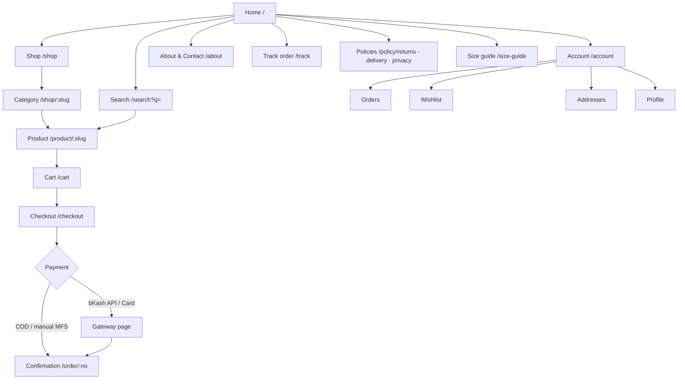
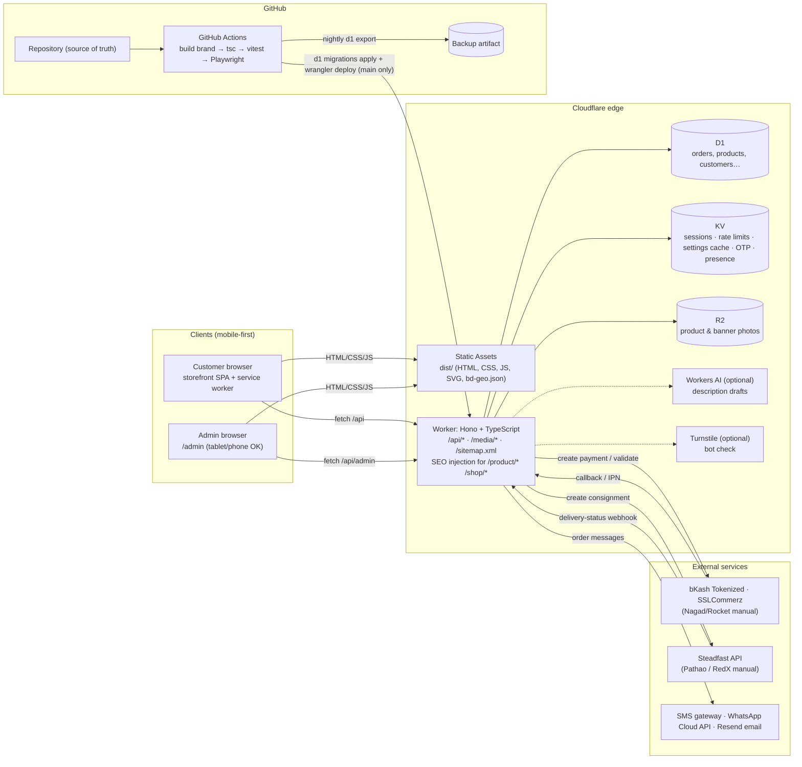
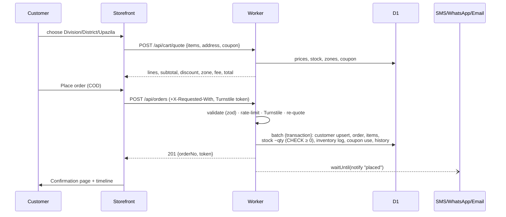
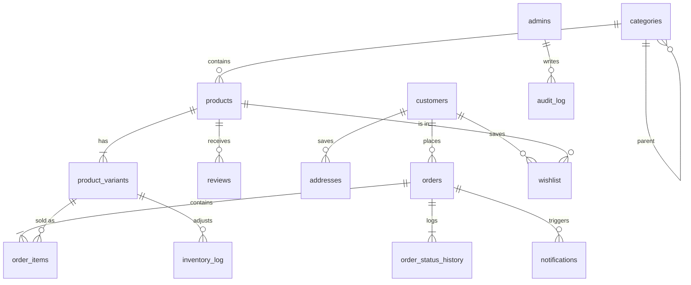
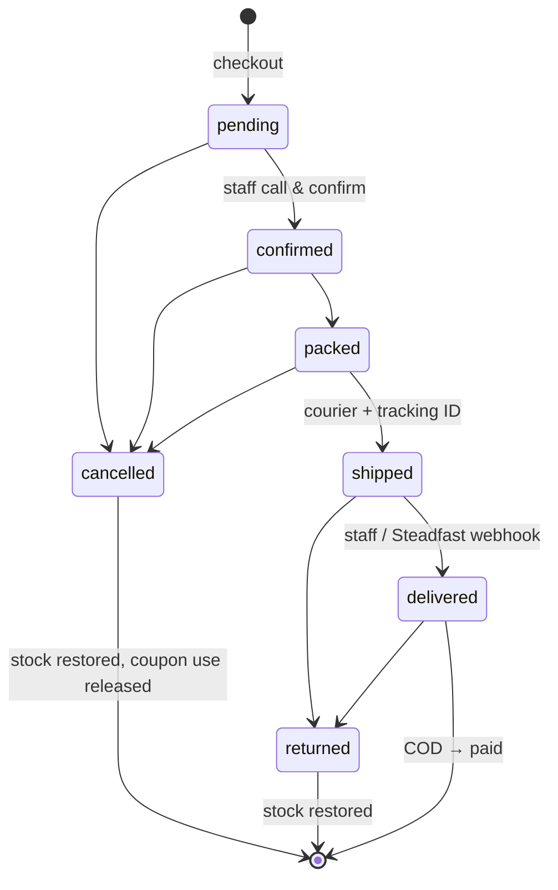

# Lk's Attire — A–Z build guide and specification

**Status:** Implemented in this repository. Where a feature needs merchant accounts that don't exist yet (bKash API mode, Nagad API, Pathao/RedX APIs), it is **stubbed with a working manual fallback**, marked 🟡 below.
**Audience:** The owner and a small, non-technical team overseeing developers. Developers should also read `README.md`, `docs/SETUP.md` and `docs/BRAND-PIPELINE.md`.

> ⚠️ **Assumptions to confirm with the owner before launch** (all adjustable without code changes unless noted):
> 1. The **colour palette**: default "Signature Noir" (black · gold · rani pink, taken from the official logo and photo shoots). Three alternatives are included (§1.3). To switch, change one line in `brands/lks-attire/brand.json`.
> 2. The **delivery-fee tiers**: Tangail town ৳50, rest of Tangail ৳80, Dhaka ৳100, rest of Bangladesh ৳130, each with a free-delivery threshold. Edit them in *Admin → Delivery zones*.
> 3. The **category list** (§13): edit it in *Admin → Categories*.
> 4. The **contact details**: phone, WhatsApp, email and map pin are placeholders in `brand.json` and *Admin → Settings*.
> 5. The **domain**: `lksattire.com` is assumed.
> 6. The **return policy**: a 3-day exchange window. The wording lives in `public/js/views/pages.js`.

---

## Contents
1. [Brand, market and business requirements](#1-brand-market--business-requirements)
2. [Public website](#2-public-website--description--layout)
3. [Admin dashboard](#3-admin-dashboard--description--layout)
4. [Full-stack architecture](#4-full-stack-architecture)
5. [Data models](#5-data-models)
6. [Payments, delivery and integrations](#6-payments-delivery--third-party-integrations)
7. [Security and compliance (NIST CSF)](#7-security--compliance)
8. [Testing strategy](#8-testing-strategy)
9. [Dashboard development plan](#9-dashboard-development-plan)
10. [File and folder structure](#10-file--folder-structure)
11. [Development environment and deployment](#11-development-environment--deployment-setup)
12. [SEO, performance and marketing](#12-seo-performance--marketing)
13. [Product categories and content plan](#13-suggested-product-categories--content-plan)
14. [Phased roadmap](#14-phased-roadmap)
15. [Development and delivery conventions](#15-development--delivery-conventions)
16. [Acceptance checklist](#16-acceptance-checklist)
17. [Glossary (Bangla UI terms)](#17-glossary)

---

## 1. Brand, market & business requirements

### 1.1 Identity
| Item | Decision |
|---|---|
| Name | **Lk's Attire** / এলকে'স অ্যাটায়ার |
| Tagline | *Style With A Signature* / *স্টাইল, নিজস্ব সিগনেচারে* (from the official logo) |
| Logo | **Official logo** (`brands/lks-attire/source/logo.jpg`): a gold serif "LK" monogram with a leaf sprig and butterfly, "LK'S ATTIRE" in white serif caps, a gold script tagline, and a woman in a draped saree, in a thin circle on black. Web sizes, app icons and the social share cover are generated by `scripts/prepare-brand-images.mjs`. **Replaceable any time in Admin → Settings → Branding.** |
| Signature motif | The **paar**: a seven-band woven border stripe in the brand colours. It appears under the header, above the footer, on hover under product photos, and on the order-confirmation seal. |
| Shapes | Arch-topped product photos, category tiles and hero frames. |
| Type | Display: Cormorant Garamond 600 (echoes the logo's serif caps). Script accents: Great Vibes (echoes the logo's script tagline). Body and all Bangla: Hind Siliguri 400/600. Fonts load with `display=swap` so text shows immediately on slow networks. |

### 1.2 Target customer
- **Age:** 18–45, core 22–38: university students, young professionals, and married women buying for family events.
- **Style:** Everyday cotton/lawn three-pieces and kurtis for work and campus. Tangail taant and jamdani for occasions. Katan/Benarasi for weddings. Modest wear (abaya/hijab) as a steady everyday category.
- **Price sensitivity:** Mid-market. Most baskets are ৳900–৳3,500, and festive/bridal pieces run ৳7,000–৳15,000. Customers watch discounts and delivery fees closely, which is why the fee is shown live and free-delivery thresholds are displayed.
- **Shopping habits:** Mobile-first, often on mid-range Android over 4G that drops to 3G. They discover through Facebook/Instagram and ask questions on WhatsApp before buying. They strongly prefer **Cash on Delivery** and like to open the parcel in front of the rider. Buying peaks before Eid, Puja, Pohela Boishakh and the winter wedding season.

### 1.3 Colour palettes (customer-facing)
Defined in `brands/lks-attire/brand.json → palettes`. Set `activePalette` to switch.

| Palette | Use | Background | Primary | Accent | Gold |
|---|---|---|---|---|---|
| **Signature Noir** (default) | The brand's own colours: black logo, gold monogram, rani-pink organza | `#FBF7F2` ivory | `#141013` black | `#D6246E` rani pink | `#D4AF45` |
| **Blush Loom** | Everyday elegance | `#FBF7F2` ivory | `#8E3B52` deep rose | `#B76E79` rose gold | `#C79A5B` |
| **Festive Maroon** | Eid/Puja/wedding campaigns | `#FFF8EC` cream | `#6B1E2E` maroon | `#C9A24A` gold | `#C9A24A` |
| **Jamdani Sage** | Calm, cotton-forward | `#F7F5EF` | `#4F5D45` sage | `#C06C4B` terracotta | `#B89456` |

You can trial a palette at build time without editing JSON: `PALETTE=festive-maroon npm run build`.

### 1.4 Language
- **All customer-facing and admin text is bilingual.** Bangla is the default, with a **বাং | EN** toggle in the header (storefront) and in the profile menu (admin). The choice is remembered.
- Copy uses plain, friendly words: "Pay when it arrives", not "COD settlement".
- Product, category and banner content has `_en` and `_bn` fields. Prices and numbers show in Bangla digits (৳১,৮৯০) when Bangla is selected.

### 1.5 Business model
- **Cash on Delivery is the default** and is pre-selected at checkout.
- **bKash, Nagad, Rocket:** manual TrxID mode works on day one. bKash has an automatic API mode 🟡 that activates when merchant keys are added.
- **Card** via SSLCommerz hosted payment page 🟡 activates when store credentials are added.

### 1.6 Physical location
**Akurtakur Para, Tangail 1900, Dhaka Division.** It appears in:
- The site footer and the About/Contact page, with a Google Maps embed. The embed URL is in `brand.json → location.mapEmbedUrl`.
- `ClothingStore` JSON-LD on every page, with geo-coordinates.
- Printed invoices and shipping labels.

### 1.7 Operated by a small, non-technical team
- Every admin action uses large targets (≥44–48 px), plain labels in both languages, and confirmation dialogs written as full sentences. Examples: *"Move 'Jersey Hijab' to Trash? You can restore it later."*, *"Cancel the order first — that puts the stock back."*
- The built-in **Help center** explains everyday tasks step by step, such as confirming a COD order, booking Steadfast, or running an Eid campaign.

---

## 2. Public website — description & layout

**Design direction: "Signature Noir."** A black-and-gold hero built from the brand's real photo shoot (three organza looks in gold-outlined arches, `brands/lks-attire/assets/cover.webp`), a rani-pink offer strip, and ivory pages with arch-framed product photos, a serif display face, script accents, the woven paar stripe (black · gold · pink) and a subtle jamdani texture. It is minimal, feminine and distinctly Bangladeshi, and avoids generic templates. Layout variants (`heroStyle`, `motif`, `cardStyle`) come from `brand.json`, so another client gets a different look from the same code (see `docs/BRAND-PIPELINE.md`).

### 2.1 Site map

*Blog/Lookbook is optional and was left out of the MVP. The festive banner plus Instagram strip cover the need until then.*

### 2.2 Homepage (`public/js/views/home.js`)
1. **Announcement bar**, editable in Settings. Example: "Cash on Delivery all over Bangladesh · Easy 3-day exchange".
1b. **Offer strip**: a scrolling rani-pink band of *Admin → Banners → Promo* items, e.g. "Use code LK10 for 10% off".
2. **Hero slider** from *Admin → Banners (Hero)*. Each slide has an arch-framed image, a bilingual headline and a CTA. It auto-rotates every 6 s, stops if the user has *reduced motion* set, and has dot navigation.
3. **Trust strip:** COD · 64 districts · 3-day exchange · Picked in Tangail.
4. **Category tiles** in arch shapes. Each tile shows the category's own image, or else its best-selling product photo.
5. **New arrivals**: a horizontal swipe rail on mobile, a grid on desktop.
6. **Festive campaign banner** (*Banners → Festive*), scheduled with start/stop dates.
7. **Best sellers** grid.
8. **Testimonials**: approved 4–5★ reviews.
9. **Instagram strip**, linking to the profile. It can be replaced with an official feed once the account is connected.
10. **WhatsApp/newsletter signup.** Entries go to the `subscribers` table.
11. **Footer** with location, phone, hours, social links, policy links and accepted payment badges.

### 2.3 Product listing (`/shop`, `/shop/:category`, `/search`)
- **Filters:** sub-category chips, size, colour swatches, price range, fabric, in-stock only, on sale. On mobile the filters open as a full-screen sheet.
- **Sort:** newest, most popular, price ↑/↓, biggest discount, top rated.
- **Grid/list toggle.** The choice is remembered.
- **"Load more" pagination**, 12 items per page. The URL updates, so filtered pages can be shared.
- **Empty state** has a "Clear all" button. **Error state** has "Try again".

### 2.4 Product detail (`/product/:slug`)
- **Photo gallery** with thumbnails. Tap to zoom 2×; the zoom follows the pointer.
- **Colour swatches and size buttons.** Sizes that are out of stock for the chosen colour are disabled and struck through.
- **Live stock message:** "In stock — ready to ship", "Hurry, only 2 left" or "Out of stock in this size/colour".
- **Price** with strikethrough and a "-12% off" pill.
- **Size-guide modal** (bust/waist/hip/length plus abaya lengths).
- **Quantity stepper** (1–20, capped by stock). **Add to cart** opens a mini-cart drawer. **Buy now** goes straight to checkout.
- **Sticky add-to-cart bar** on mobile once the main button scrolls away.
- **Tabs:** Description · Fabric & care · Delivery & returns · Reviews (with shop replies) and a *Write a review* form. New reviews wait for moderation.
- **Share:** Facebook, WhatsApp, copy link, and the native share sheet. **"Ask about this on WhatsApp"** pre-fills the product name and link.
- **You may also like** rail: same category first, then best sellers.
- **Server-rendered SEO:** the Worker injects the title, description, Open Graph tags and `Product`/`BreadcrumbList` JSON-LD, so Facebook/WhatsApp link previews show the real product.

### 2.5 Cart and checkout
- **Guest checkout** with no account needed. Signed-in customers can pick saved addresses.
- **Quick area search (auto-fill):** the customer types a **postcode** (`1900`, also in Bangla digits `১৯০০`) or a **place name** in English or Bangla (`Mirzapur`, `মির্জাপুর`, `Dhanmondi`) and picks from the list. Division, District and Upazila are selected automatically. Data: 8 divisions, 64 districts, 494 upazilas and 1,368 postcodes from [Bangladesh-geocode](https://github.com/bayeziddev/Bangladesh-geocode) (MIT), rebuilt with `scripts/build-postcodes.py`.
- **Bangladesh address form:** Division → District → Upazila selects (`public/data/bd-geo.json`, Bangla or English names), then a free-text *area/road/house/village* field.
- **Live delivery fee:** choosing the upazila immediately shows the zone ("Inside Tangail town · Same or next day"), the fee, and any free-delivery threshold.
- **Payment method cards:** COD (default), bKash, Nagad, Rocket, Card. For manual MFS, step-by-step instructions appear with the exact amount and the shop's number, plus a **TrxID** field.
- **Coupon code field**, an order summary, and an optional note.
- **Prices are always recalculated on the server.** If a price changed or stock ran out, the customer sees a clear message and no order is created.
- **Confirmation page** with the order number and a status timeline. The customer gets an SMS/WhatsApp/email confirmation in their chosen language.

### 2.6 Account area
- Register or sign in with **mobile number + password**. Registering with a number that already placed guest orders **claims those past orders**.
- **Order history** with live status. **Wishlist**: guests' wishlists are stored locally and synced on sign-in.
- **Saved addresses** (up to 10, one default). **Profile editing** and password change.
- **Password reset** with a 6-digit SMS code: 10-minute expiry, 5 tries, and the same response whether or not the number exists.

### 2.7 Performance on a mid-range Android over 3G/4G
See §12.3. In short: no framework and no bundler; about 30 KB gzip of JS on the home page, split per page with dynamic `import()`; inline SVG icons; lazy images with fixed dimensions (no layout shift); edge-cached assets; a service worker for fast repeat visits and an offline shell.

---

## 3. Admin dashboard — description & layout

### 3.1 Visual style
**Soft UI (neumorphism)** on a lavender-white base. Raised cards use paired light/dark shadows, inputs look pressed-in (inset), and primary actions use a **purple → pink gradient**. Radii are 16–30 px. Tokens (`--a-primary`, `--a-pink`, `--a-bg`) come from `brand.json → admin`, so each client gets their own admin colours.

### 3.2 Three-pane layout
```
┌──────────────┬──────────────────────────────────────┬────────────────────┐
│ LEFT SIDEBAR │ CENTER PANEL                         │ RIGHT RAIL         │
│ purple grad. │ Page heading + primary action        │ 🔍 Global search   │
│ rounded edge │ KPI cards (6, each own accent+bar)   │ 👤 Profile menu    │
│ ▣ Dashboard  │ Monthly sales line chart | Top 6     │    (Profile, Lang, │
│ 🛍 Orders  ⓷ │ Recent orders table                  │     Sign out)      │
│ 👗 Products  │                                      │ 🔔 Notifications   │
│ 📊 Reports   │                                      │   new orders, low  │
│ ⚙ Settings   │                                      │   stock, reviews   │
│ — Catalogue —│                                      │ 🟢 Online now      │
│ Categories…  │                                      │   (other staff +   │
│ — System —   │                                      │    what page)      │
│ Staff, Log…  │                                      │                    │
│ [« Collapse] │                                      │                    │
└──────────────┴──────────────────────────────────────┴────────────────────┘
```
- **Desktop (≥1280 px):** all three panes. The sidebar collapses to an icon rail.
- **Tablet (900–1279 px):** icon rail plus a top bar. The right rail opens as a drawer from the 🔔 button.
- **Phone (<900 px):** hamburger drawer for the menu and 🔔 drawer for the right rail. Tables turn into stacked cards, so there is **no horizontal scrolling**; this is verified by an E2E test.

### 3.3 Dashboard home
KPI cards, each with its own accent colour and a progress bar:
- **Today's orders** and **Today's sales**, with Δ vs yesterday.
- **This month's sales**, with Δ vs last month. The bar shows progress through the month.
- **Waiting for confirmation**, with how many are COD. Tapping it filters Orders.
- **Low-stock items** out of all variants. Tapping it filters Inventory.
- **New customers (7 days)**, with Δ vs the previous week.

Below the cards: a **12-month sales line chart** (revenue plus dashed order count, Chart.js), **top sellers (30 days)** and **recent orders**. Days are counted in Bangladesh time (UTC+6).

### 3.4 CRUD modules — fields, list columns, filters, validation
Every list has **search, filters, pagination, and loading/empty/error states**. Create/edit happens in a **slide-over panel**. Deletes go to **Trash** (soft delete) after a plain-language confirmation. A **Restore** button is in the Trash tab, and only a Super Admin can **Delete forever**. **Toasts** confirm success or explain failure in the chosen language. **Buttons the role can't use are hidden**, and the API enforces the same rules.

| Module | Fields (✱ required) | List columns | Filters | Key validation rules |
|---|---|---|---|---|
| **Products** | name_en✱, name_bn✱, slug✱, sku, category✱, status (active/draft/archived), featured, price✱, sale_price, tags, photos (≤12, first = cover, auto-resized to 1600px WebP in the browser), description/fabric/care EN+BN, meta title/description, **variants✱** (size✱, colour✱, hex, stock✱, low-stock threshold, price override) | photo, name+SKU+category, price (+strikethrough), stock health (Out/Low/OK + variant count), sold, status | search (name/SKU/tag), category (incl. sub-categories), status, stock (low/out), sort, Trash | price > 0; sale < price; slug unique, lowercase-dashed; ≥1 variant; no duplicate size+colour; stock ≥ 0. **Bulk:** CSV export, CSV import (row-level bilingual errors, upsert by slug/size/colour), duplicate-as-draft, AI description draft |
| **Categories** | name_en✱, name_bn✱, slug✱, parent, descriptions, tile image, order, active | nested tree with product counts | — | slug unique; can't be its own parent; can't delete while it has products. **Drag-to-reorder** and drag-into-parent |
| **Orders** | (created by checkout) editable: customer name/phone/email, area, staff notes, payment status/ref, courier, tracking | order no + time, customer + phone, area, total + items, payment + status, pipeline status + tracking | status tabs with counts, search (no/name/phone/tracking), payment method, date range, Trash | strict pipeline (§6.4); shipping requires courier + tracking ID (or auto Steadfast booking); refund ≤ total; delete only after cancel/return/deliver. **Detail:** pipeline bar, next-step buttons, call/WhatsApp, risk hint (past cancellations), items, totals, mark paid, refund, notes, history, messages log, **print invoice / shipping label**, resend SMS, **bulk confirm / pack** |
| **Customers** | name✱, phone✱ (BD format), email, blocked, internal notes | name (+account badge), phone, orders, total spent, status, joined | search, blocked/active, Trash | phone unique; blocked customers can't sign in or order. Detail shows order history and saved addresses |
| **Coupons** | code✱ (A–Z0–9-_), description, type✱ (percent/flat), value✱, min order, max discount, starts/expires, total limit, per-customer limit, categories, active | code, discount, min order, used/limit, expiry, status (incl. "Expired") | search, type, Trash | percent ≤ 90; expiry after start; category rules include sub-categories |
| **Banners** | placement✱ (hero/festive/promo), titles EN/BN✱, subtitles, CTA text, link, image (upload), start/stop, order, active | image, title, placement, schedule, "showing now" | search, placement, Trash | dates valid; auto-hidden outside schedule |
| **Reviews** | status (pending/approved/rejected/flagged), public reply | stars + text (+reply), author/date, product, status | status, search, Trash | one-tap Approve / Reject / Flag; product rating recalculated automatically |
| **Inventory** | per variant: set / add / remove with reason (restock/correction/return) | product, size/colour swatch, stock pill, "new stock" input, ±1/+5 | search, low, out | stock never below 0; every change logged with who/why (**stock history**); bulk "set" for many rows then one Save |
| **Delivery zones** | names EN/BN✱, code✱, fee✱, free-over, ETA EN/BN, districts, upazilas, default, order, active | zone, fee, free-over, coverage, ETA | search | only one default zone; most specific match wins |
| **Staff & roles** | name✱, email✱, phone, role✱, password (≥10), can sign in | name/email, role, last sign-in, status | search, role, Trash | can't demote/deactivate/delete yourself; at least one Super Admin must remain. **Permission matrix** shown under the list |
| **Reports** | — | sales by day/month/category/product/payment/zone; best customers; courier performance (shipped/delivered/returned/success %/avg days) | date range, group-by | CSV export for every report |
| **Settings** | store info, announcement, payment methods (enable, manual numbers, bKash mode), notification channels, owner phone, **SMS templates EN/BN** per stage, SEO defaults, analytics IDs | integration status (Connected / Not connected) for each service | — | **refuses API secrets** (those live in Wrangler secrets) |
| **Activity log** | read-only | when, who (+IP), action, item, details | search, item type, action | written for every admin mutation, sign-in and failed sign-in |

### 3.5 Roles and permission matrix
Defined once in `worker/src/lib/rbac.ts`. It is enforced on every API route and mirrored in the UI.

| Permission area | Super Admin | Manager | Order Processor | Read-only Viewer |
|---|:-:|:-:|:-:|:-:|
| Dashboard, reports | ✅ | ✅ | dashboard only | ✅ |
| Orders: view / update status | ✅ | ✅ | ✅ | view |
| Orders: refund / delete | ✅ | ✅ | ❌ | ❌ |
| Products, categories, inventory: edit | ✅ | ✅ | view | view |
| Customers, coupons, banners, reviews, zones: edit | ✅ | ✅ | view (customers, reviews, zones) | view |
| Staff management | ✅ | ❌ | ❌ | ❌ |
| System settings (payments, SMS, SEO) | ✅ | view | ❌ | ❌ |
| Activity log | ✅ | ✅ | ❌ | ✅ |
| Delete forever from Trash | ✅ | ❌ | ❌ | ❌ |

---

## 4. Full-stack architecture

### 4.1 One Worker, one repository
A single **Cloudflare Worker (Hono + TypeScript)** does everything:
- Serves the **static storefront** (`/`) and **admin app** (`/admin/`) through **Workers Static Assets**, straight from Cloudflare's edge cache. The Worker code doesn't even run for these files.
- Runs first only for dynamic paths: `/api/*`, `/media/*` (R2 images), `/sitemap.xml`, and `/product/*` and `/shop/*` (server-side SEO meta injection with `HTMLRewriter`).
- Uses **D1** (SQLite) for all relational data, **KV** for sessions/rate limits/settings cache/OTP codes/presence, and **R2** for product and banner photos (through the `MEDIA` binding; a signed-URL pattern is only needed if the bucket ends up in another account).

**Why this satisfies both "GitHub" and "Cloudflare":** GitHub is the **source of truth and the CI/CD pipeline**. Every change is a commit or pull request, and GitHub Actions runs the tests and deploys. Cloudflare Workers is the **runtime** that actually serves customers. There's no need to choose between GitHub Pages and Cloudflare: GitHub builds and ships, Cloudflare serves.

### 4.2 System diagram


### 4.3 Checkout sequence


---

## 5. Data models

The canonical source is `worker/migrations/0001_init.sql`. Money is stored as **whole Taka (INTEGER)**, timestamps as ISO-8601 UTC, and `deleted_at` marks soft-deleted rows (Trash).



### `categories`
| Column | Type | Notes |
|---|---|---|
| id | INTEGER PK | |
| parent_id | INTEGER FK → categories.id | NULL = top level (e.g. Saree → Cotton Saree) |
| slug | TEXT UNIQUE | URL `/shop/:slug` |
| name_en / name_bn | TEXT | |
| description_en / description_bn | TEXT | |
| image_url | TEXT | optional tile image |
| sort_order | INTEGER | drag-to-reorder |
| is_active | INTEGER (0/1) | |
| deleted_at, created_at, updated_at | TEXT | |

### `products`
| Column | Type | Notes |
|---|---|---|
| id | INTEGER PK | |
| slug | TEXT UNIQUE | SEO URL |
| sku | TEXT UNIQUE (case-insensitive) | blank → generated as `<PREFIX>-<id>`, e.g. `LKS-0042` |
| name_en / name_bn | TEXT | |
| description_en/bn, fabric_en/bn, care_en/bn | TEXT | |
| category_id | FK → categories.id | |
| price | INTEGER ≥ 0 | regular price ৳ |
| sale_price | INTEGER NULL | shown with strikethrough when lower; calculated from the discount below |
| discount_type, discount_value | TEXT, INTEGER | `none` (typed sale price) · `percent` (1–95) · `flat` (৳ off) |
| delivery_mode, delivery_charge | TEXT, INTEGER NULL | `zone` (area fee) · `free` · `fixed` (৳ charge) |
| tags | TEXT | comma separated |
| images | TEXT (JSON array) | R2 `/media/...` URLs, first = cover |
| status | TEXT | `draft` · `active` · `archived` |
| is_featured | INTEGER | |
| sold_count, rating_avg, rating_count | INTEGER/REAL | denormalised for fast sorting |
| meta_title, meta_description | TEXT | SEO overrides |
| deleted_at, created_at, updated_at | TEXT | |

### `product_variants`
| Column | Type | Notes |
|---|---|---|
| id | INTEGER PK | |
| product_id | FK → products.id (CASCADE) | |
| sku | TEXT UNIQUE (case-insensitive) | blank → `<product SKU>-<SIZE>-<COLOUR>`, e.g. `LKS-0042-XL-RED` |
| size / color | TEXT | UNIQUE(product_id, size, color) |
| color_hex | TEXT | swatch |
| stock | INTEGER **CHECK ≥ 0** | the CHECK makes overselling impossible, even under concurrency |
| price_override | INTEGER NULL | e.g. XXL costs more |
| low_stock_threshold | INTEGER (default 3) | drives alerts |

### `customers`
| Column | Type | Notes |
|---|---|---|
| id | INTEGER PK | |
| name | TEXT | |
| phone | TEXT UNIQUE | `01XXXXXXXXX` (normalised) |
| email | TEXT | |
| password_hash | TEXT NULL | NULL = guest-only customer |
| is_blocked | INTEGER | |
| notes | TEXT | staff-only |
| last_login_at, deleted_at, created_at, updated_at | TEXT | |

### `addresses` (Bangladesh-specific)
| Column | Type | Notes |
|---|---|---|
| id | INTEGER PK | |
| customer_id | FK → customers.id | |
| label, recipient_name, phone | TEXT | |
| division_id / district_id / upazila_id | INTEGER | IDs from `bd-geo.json` |
| division / district / upazila | TEXT | names (English) for couriers |
| area | TEXT | area / village / road / house |
| zone_code | TEXT | **delivery-fee tier** resolved at save time |
| is_default | INTEGER | |

### `delivery_zones`
| Column | Type | Notes |
|---|---|---|
| id | INTEGER PK | |
| code | TEXT UNIQUE | `tangail_town`, `tangail_outer`, `dhaka`, `rest_bd` |
| name_en / name_bn | TEXT | |
| fee | INTEGER | ৳ |
| free_shipping_min | INTEGER NULL | free delivery at/above this merchandise total |
| district_ids / upazila_ids | TEXT (JSON arrays) | upazila match beats district match beats default |
| eta_en / eta_bn | TEXT | shown at checkout |
| is_default, is_active, sort_order | INTEGER | |

### `orders`
| Column | Type | Notes |
|---|---|---|
| id | INTEGER PK | |
| order_no | TEXT UNIQUE | `LKS-YYMMDD-XXXX` (prefix from brand.json) |
| invoice_no | TEXT UNIQUE | `INV-YYMM-<5-digit order id>`, e.g. `INV-2609-00042`; printed on the invoice and label, sent in SMS, accepted by order tracking |
| public_token | TEXT | lets a guest view their own order |
| customer_id | FK → customers.id NULL | |
| customer_name / customer_phone / customer_email | TEXT | snapshot at order time |
| division_id, district_id, upazila_id, division, district, upazila, area | | delivery address snapshot |
| zone_code | TEXT | |
| subtotal, discount, delivery_fee, total | INTEGER | server-calculated |
| coupon_code | TEXT | |
| payment_method | TEXT | `COD` · `bKash` · `Nagad` · `Rocket` · `Card` |
| payment_status | TEXT | `pending` · `paid` · `failed` · `refunded` · `partially_refunded` |
| payment_ref | TEXT | gateway ID / MFS TrxID |
| status | TEXT | `pending` · `confirmed` · `packed` · `shipped` · `delivered` · `returned` · `cancelled` |
| courier_partner | TEXT | `Steadfast` · `Pathao` · `RedX` |
| tracking_id, consignment_id | TEXT | |
| customer_note, admin_notes | TEXT | |
| lang | TEXT | `bn`/`en`, the language for the customer's messages |
| refund_amount, refund_note | | |
| deleted_at, created_at, updated_at | TEXT | |

### `order_items`
`id`, `order_id` FK, `product_id` FK, `variant_id` FK, `category_id`, `sku`, `name_en`, `name_bn`, `size`, `color`, `image`, `quantity` (>0), `unit_price`, `line_total`. This is a snapshot, so later product edits don't change past orders.

### `order_status_history`
`id`, `order_id` FK, `status`, `note`, `actor` (`customer`, `system`, `courier:Steadfast`, or staff name), `created_at`.

### `reviews`
`id`, `product_id` FK, `customer_id` FK NULL, `name`, `rating` (1–5), `body`, `status` (`pending`/`approved`/`rejected`/`flagged`), `reply`, `replied_at`, `deleted_at`, timestamps.

### `coupons`
`id`, `code` UNIQUE (case-insensitive), `description`, `type` (`percent`/`flat`), `value`, `min_order`, `max_discount`, `starts_at`, `expires_at`, `usage_limit`, `used_count`, `per_customer_limit`, `category_ids` (JSON; empty means the whole store), `is_active`, `deleted_at`, timestamps.

### `admins` (with roles)
`id`, `name`, `email` UNIQUE, `phone`, `password_hash` (PBKDF2), `role` (`super_admin`/`manager`/`order_processor`/`viewer`), `is_active`, `last_login_at`, `deleted_at`, timestamps.

### `inventory_log`
`id`, `product_id`, `variant_id`, `change` (±), `stock_after`, `reason` (`order`/`cancel`/`return`/`restock`/`adjustment`/`import`), `note`, `actor`, `created_at`.

### Supporting tables
`banners` (hero/festive/promo with schedule), `settings` (key → JSON), `audit_log`, `notifications` (every SMS/WhatsApp/email attempt: sent/failed/skipped), `wishlist`, `subscribers`.

### Worked example — the Order model in TypeScript
This matches the API response from `GET /api/admin/orders/:id` (see `worker/src/lib/orders.ts → OrderRow`), reshaped into the nested form used in the brief:
```typescript
type Division = string;   // e.g. "Dhaka"
type PaymentMethod = "COD" | "bKash" | "Nagad" | "Rocket" | "Card";
type OrderStatus = "pending" | "confirmed" | "packed" | "shipped" | "delivered" | "returned" | "cancelled";

interface Order {
  id: string;                       // order_no, e.g. "LKS-260924-7KQM"
  customer: {
    name: string;
    phone: string;                  // "01711223344"
    email?: string;
    address: { division: Division; district: string; upazila: string; area: string };
  };
  items: Array<{
    productId: string;
    variant: { size: string; color: string };
    quantity: number;
    unitPrice: number;              // whole Taka, server-calculated
  }>;
  zoneCode: "tangail_town" | "tangail_outer" | "dhaka" | "rest_bd" | string;
  subtotal: number;
  discount: number;
  couponCode?: string;
  deliveryFee: number;
  total: number;
  paymentMethod: PaymentMethod;
  paymentStatus: "pending" | "paid" | "failed" | "refunded" | "partially_refunded";
  paymentRef?: string;              // bKash trxID / SSLCommerz bank_tran_id / manual TrxID
  orderStatus: OrderStatus;
  courier?: { partner: "Steadfast" | "Pathao" | "RedX"; trackingId?: string; consignmentId?: string };
  lang: "bn" | "en";
  createdAt: string;                // ISO-8601 UTC
}
```

---

## 6. Payments, delivery & third-party integrations

### 6.1 Payments (`worker/src/lib/payments.ts`, `routes/callbacks.ts`)
| Method | Status | Flow |
|---|---|---|
| **Cash on Delivery** | ✅ | The order is created with `payment_status=pending`. It becomes `paid` automatically when marked **Delivered**. |
| **bKash — manual** | ✅ | The customer sends money to the shop's number (shown with the exact amount) and types the **TrxID**. Staff verify it in the bKash app, then click **Mark as paid**. No API keys needed. |
| **bKash — Tokenized Checkout (API)** | 🟡 implemented, activates with keys | 1) grant token (cached in KV about 55 min) → 2) `create` with `callbackURL`, `merchantInvoiceNumber=order_no` → 3) redirect to `bkashURL` → 4) `GET /api/payments/bkash/callback?paymentID&status` → 5) `execute`. If `transactionStatus=Completed` and the invoice matches, the order is marked paid with the trxID. Cancel or failure marks the payment failed; **the order is kept** so staff can follow up. |
| **Nagad / Rocket** | ✅ manual · 🟡 Nagad API stub | Same TrxID flow as manual bKash. Nagad's API needs RSA-signed merchant requests; `nagadInitiate()` is a documented stub until merchant onboarding. |
| **Card (and MFS inside) — SSLCommerz** | 🟡 implemented, activates with keys | `POST /gwprocess/v4/api.php` → redirect to `GatewayPageURL` → the **IPN** (`POST /api/payments/sslcommerz/ipn`) is the source of truth: the server calls the **validation API** with `val_id` and checks that the status is `VALID/VALIDATED` and the amount is at least the order total before marking it paid. The browser return (`/return`) only displays the result. We never see card data, which keeps PCI scope minimal (SAQ-A style). |

### 6.2 Delivery and couriers (`worker/src/lib/couriers.ts`)
- **Steadfast (primary)** ✅: when staff choose *Shipped → Steadfast → "Book automatically"*, the Worker calls `POST /create_order` (invoice = order_no, COD amount = total unless already paid) and stores the `consignment_id` and `tracking_code`. The **webhook** `POST /api/webhooks/steadfast` (Bearer token) maps `delivered`/`partial_delivered` → Delivered and `cancelled` → Returned, and stores tracking messages in the order history.
- **Pathao / RedX** 🟡: staff create the parcel in the courier's merchant panel and type the tracking ID. Tracking links are generated for all three. API automation can be added later without changing the pipeline.

### 6.3 Delivery-fee logic
`resolveZone(zones, district_id, upazila_id)`: an **upazila match** is used first, then a **district match**, then the **default zone**. The fee is `0` if the merchandise total (after discount) is at or above the zone's `free_shipping_min`. The same function runs for the live checkout display, the cart quote and the final order, so they always agree.

**Per-product delivery** (`cartDeliveryFee`): each product uses the area fee (`zone`), **free delivery** or its own **fixed** charge. A cart pays the highest fee among its items, so delivery is free only when every item is free. Example to Dhaka: a free-delivery saree alone → ৳0; the same saree plus a normal kurti → ৳100.

**Admin search** (top of every admin page) finds a customer's data by invoice no, order no, phone (also typed as +880…), name, email, TrxID, tracking ID or any SKU they bought.

### 6.4 Order pipeline and notifications

**Every transition** writes history and an audit log entry, and sends the customer a message in their language: SMS (BulkSMSBD-compatible gateway), WhatsApp Cloud API, and/or email (Resend), depending on *Settings → Customer messages*. Templates are editable per stage in English and Bangla. If a provider isn't configured, the message is logged as *skipped*, so orders are never blocked.

### 6.5 Optional integrations
- **Analytics:** GA4 ID, Meta Pixel ID and a Cloudflare Web Analytics token are entered in Settings and loaded only when set.
- **Bot protection:** Cloudflare **Turnstile** on sign-in, registration and checkout when `TURNSTILE_SITE_KEY`/`TURNSTILE_SECRET` are set.
- **Workers AI** (Phase 3, implemented behind an optional binding): *Products → Write with AI* drafts bilingual descriptions. It returns a clear message if AI isn't enabled.
- **Social login (Google/Facebook), recommendations widget, policy chatbot:** listed in the roadmap (§14).

---

## 7. Security & compliance

Aligned with the **NIST Cybersecurity Framework 2.0**, scoped to a small retail store handling customer PII and payment redirects. See `docs/SECURITY.md` for the full runbook.

| Function | What we do |
|---|---|
| **Govern** | The owner is the security decision-maker. One trusted staff member is the named deputy, and both hold the Super Admin role. The owner approves any new staff account and role (*Staff & roles*). Vendor risk: payment (bKash, SSLCommerz) and courier (Steadfast) accounts are in the business's name with 2FA. Access is reviewed each quarter using the Activity log. |
| **Identify** | Data assets: customer PII (name, phone, address, email) in D1; order and payment references in D1; photos in R2; sessions/OTPs in KV (short TTLs); secrets in Wrangler secrets. **Data flow:** browser → Worker (HTTPS) → D1/KV/R2. The Worker sends only what each provider needs: payment gateways get amount/order no/name/phone; couriers get name/phone/address/COD amount; SMS providers get phone + message. Card data never touches our systems. |
| **Protect** | PBKDF2-SHA256 (100k iterations, per-user salt, constant-time compare). HTTPS everywhere with HSTS. Session cookies are `HttpOnly`, `Secure`, `SameSite=Strict` (admin, 12h) or `Lax` (customer, 30d). **CSRF:** same-origin check plus a required `X-Requested-With` header. **RBAC** on every admin route. A strict **CSP** with no inline scripts. All data rendered through an auto-escaping template helper (no XSS from reviews/names). Parameterised SQL only. CSV-export formula-injection guard. Upload type/size checks. Secrets only in `wrangler secret`/`.dev.vars` (git-ignored), and Settings refuses to store keys. Hosted/redirect payments minimise PCI scope. |
| **Detect** | An **audit log** of every admin change, sign-in and failed sign-in (with IP). **Rate limits** (KV): checkout 15/10 min, admin sign-in 10/15 min, customer sign-in 10/15 min, OTP 5/h, reviews 5/h. Optional Turnstile. **Alert:** the owner gets an SMS after 5 failed admin sign-ins from one IP. Workers observability logs are enabled. |
| **Respond** | The incident outline in `docs/SECURITY.md`: contain (deactivate the account, rotate secrets with `wrangler secret put`, sign everyone out by clearing KV sessions), assess (Activity log, Worker logs), notify affected customers by SMS in Bangla/English within 72 hours if PII was exposed, and notify payment/courier partners. |
| **Recover** | **Nightly D1 export** via GitHub Actions (30-day artifact retention) plus D1 **Time Travel** (point-in-time restore for the last 30 days on paid plans). R2 photos are immutable by key. The documented restore procedure and a quarterly restore drill are in `docs/SECURITY.md`. |

---

## 8. Testing strategy

| Layer | Tooling | What's covered | Command |
|---|---|---|---|
| Type safety | `tsc --noEmit` (strict, `noUncheckedIndexedAccess`) | Worker, libraries and tests | `npm run typecheck` |
| Unit | Vitest in the **Workers runtime** (`@cloudflare/vitest-pool-workers`) | pricing and zones, coupon rules, order state machine, PBKDF2, CSV (incl. formula guard), phone normalisation, RBAC matrix, courier status mapping, templates | `npm test` |
| Integration | Same, against real local **D1/KV/R2** with migrations and seed applied | catalogue filters, product detail, delivery fee, SEO page + sitemap, CSRF rejection, bilingual validation errors, COD order and stock decrement, oversell protection, manual-bKash TrxID rule, admin auth, dashboard, full pipeline with history/notifications/restock, product CRUD with variants and inventory log, RBAC denial, coupons, audit log, secret-in-settings refusal | `npm test` |
| End-to-end | **Playwright** on Pixel 5 and Desktop Chrome against `wrangler dev` with a fresh D1 | browse → filter → product → variant → cart → checkout with Division/District/Upazila and live zone → COD → confirmation; language toggle; staff sign-in and order confirm; **no horizontal scroll in the admin on a phone** | `npm run test:e2e` |
| CI gate | GitHub Actions | all of the above must pass before `wrangler deploy` | automatic |

**Fixtures** (`tests/fixtures/`): `product-list.response.json`, `create-order.request.json`, `create-order.response.json`, `admin-login.request.json`, `admin-login.response.json`, `error.validation.response.json`. The integration test asserts the live API matches the product-list fixture's shape.

Example: create order.
```http
POST /api/orders
Content-Type: application/json
X-Requested-With: fetch

{ "customer": { "name": "Nusrat Jahan", "phone": "01711223344" },
  "address": { "division_id": 6, "district_id": 44, "upazila_id": 342, "division": "Dhaka",
               "district": "Tangail", "upazila": "Tangail Sadar", "area": "Akurtakur Para, Road 3" },
  "items": [{ "variantId": 1, "quantity": 2 }], "paymentMethod": "COD", "lang": "bn" }

→ 201 { "orderNo": "LKS-260924-7KQM", "token": "kXFL4N…", "total": 4300, "redirectUrl": null }
```

---

## 9. Dashboard development plan

- **Stack:** vanilla ES modules plus small, focused helpers (`admin/js/core.js`: an escaping `html` template, API client, slide-over, confirm dialog, schema-driven forms, list tables). There is **no build tooling**, so any developer can read and change it. **Chart.js 4** is lazy-loaded from jsDelivr only on the dashboard; if it can't load, the numbers appear as a table.
- **Schema-driven modules:** simple resources (customers, coupons, banners, reviews, zones, staff) are declared in `admin/js/resources.js` (fields, columns, filters, row actions). The generic view gives search, filters, pagination, create/edit slide-over, Trash and restore. Complex modules (orders, products, categories, inventory, reports, settings) have dedicated views.
- **Tablet/phone use:** responsive three-pane layout (§3.2), 44–48 px targets, stacked table cards, and bottom-sheet-like slide-overs. Verified by an E2E test for horizontal overflow.
- **Every data view has loading (skeleton shimmer), empty (friendly message) and error (message + "Try again") states.**

---

## 10. File & folder structure
```
lks-attire/
├── brands/                         ← brand pipeline inputs (one folder per client)
│   ├── lks-attire/brand.json       ← name, tagline, 3 palettes, fonts, layout variants, contact, seed data
│   └── _template/brand.json        ← example 2nd client ("Nokshi House") with a different look
├── scripts/
│   ├── build-brand.mjs             ← generates dist/, tokens, SEO, manifest, placeholder art, seed.sql
│   └── create-admin.mjs            ← prints SQL to create/reset an admin (PBKDF2)
├── worker/
│   ├── migrations/0001_init.sql    ← D1 schema
│   └── src/
│       ├── index.ts                ← Hono app: middleware, routes, error handler
│       ├── env.ts                  ← bindings & secrets types
│       ├── middleware.ts           ← security headers, CSRF, auth, permissions, language
│       ├── brand.generated.ts      ← (generated, git-ignored)
│       ├── lib/                    ← crypto, http/errors, schemas (zod), pricing, orders,
│       │                             payments (bKash/SSLCommerz/Nagad), couriers (Steadfast),
│       │                             notify (SMS/WhatsApp/email), rbac, csv, store (settings/KV/audit)
│       └── routes/
│           ├── public.ts           ← catalogue, config, delivery fee, quote, checkout, tracking, reviews
│           ├── customer.ts         ← auth, OTP reset, profile, orders, addresses, wishlist
│           ├── callbacks.ts        ← bKash callback, SSLCommerz IPN/return, Steadfast webhook
│           ├── seo.ts              ← sitemap, product/category meta injection, R2 media
│           └── admin/              ← auth, crud (generic), products, orders, insights, system
├── public/                         ← storefront (copied into dist/)
│   ├── index.html · _headers · sw.js
│   ├── css/store.css
│   ├── js/app.js · core.js · i18n.js · components.js
│   ├── js/views/home · shop · product · checkout · order · account · pages
│   └── data/bd-geo.json            ← 8 divisions · 64 districts · 494 upazilas (EN + BN)
├── admin/                          ← admin app (copied into dist/admin/)
│   ├── index.html · css/admin.css
│   └── js/app.js · core.js · i18n.js · resources.js · views/*
├── tests/
│   ├── unit/ · integration/ · e2e/ · fixtures/
│   ├── setup.ts · env.d.ts
├── .github/workflows/ci-deploy.yml · d1-backup.yml
├── docs/  SPEC.md · BRAND-PIPELINE.md · SETUP.md · SECURITY.md · BRIEF.md
├── wrangler.toml · vitest.config.ts · playwright.config.ts · tsconfig.json
└── .dev.vars.example
```

---

## 11. Development environment & deployment setup
**Automatic (recommended):** add the GitHub secrets listed in **`docs/GITHUB-SECRETS.md`** and push to `main`. `scripts/provision.mjs` finds or creates the D1 database, KV namespace and R2 bucket (falling back to KV storage for photos if R2 isn't enabled), writes the bindings into `wrangler.toml`, applies migrations, seeds on the first run only, creates the first Super Admin, deploys, and copies optional integration secrets into the Worker.

**Manual** instructions are in **`docs/SETUP.md`**. In summary:
1. Node.js **22 LTS** (≥20 works). `npm ci`.
2. `npx wrangler login`.
3. `npx wrangler d1 create lks-attire-db` → paste `database_id` into `wrangler.toml`.
4. `npx wrangler kv namespace create KV` → paste the `id`.
5. `npx wrangler r2 bucket create lks-attire-media`.
6. `cp .dev.vars.example .dev.vars` for local secrets. For production: `npx wrangler secret put SMS_API_KEY` and so on.
7. `npm run db:migrate:local && npm run db:seed:local && npm run dev`.
8. First admin: `node scripts/create-admin.mjs "Owner" owner@… 'long-password' > admin.sql && npx wrangler d1 execute DB --remote --file=admin.sql && rm admin.sql`, or use the one-time `BOOTSTRAP_TOKEN` endpoint.
9. **GitHub:** `main` = production. Feature branches go through pull requests, and CI must pass. Add secrets `CLOUDFLARE_API_TOKEN` and `CLOUDFLARE_ACCOUNT_ID`, plus `ADMIN_USERNAME`/`ADMIN_PASSWORD` for the first admin. Optional variables: `WORKER_NAME`, `PUBLIC_URL`, `BRAND`. Full list: `docs/GITHUB-SECRETS.md`.
10. **Domain:** add `lksattire.com` to Cloudflare DNS, then uncomment the `routes` custom-domain block in `wrangler.toml`. Cloudflare issues the certificate automatically.

The workflow (`.github/workflows/ci-deploy.yml`) runs **build → typecheck → unit/integration → E2E** on every push/PR. On `main` it then runs **D1 migrations → `wrangler deploy` → smoke test**.

---

## 12. SEO, performance & marketing

### 12.1 On-page SEO
- `<title>`, meta description, canonical, Open Graph and Twitter cards on every page. They are **server-injected for product and category pages**, so shares show the right photo and price.
- `hreflang` bn/en alternates; `lang` attribute switches with the toggle.
- **`/sitemap.xml`** (dynamic: home, shop, about, every active category and product, with hreflang links) and **`/robots.txt`** (blocks `/admin`, `/api`, `/checkout`, `/account`).

### 12.2 Structured data
- **`ClothingStore`** JSON-LD on every page: name (EN + BN alternate), address *Akurtakur Para, Tangail 1900, Dhaka Division, BD*, geo-coordinates, phone, accepted payments, `sameAs` social profiles.
- **`Product`** JSON-LD on product pages: images, SKU, brand, `Offer` (BDT price, availability from live stock, BD shipping region), `AggregateRating` when there are approved reviews, plus a **`BreadcrumbList`**.

### 12.3 Core Web Vitals targets (mid-range Android, "Fast 3G/4G")
| Metric | Target | How |
|---|---|---|
| LCP | ≤ 2.5 s | hero image `fetchpriority=high`, fixed dimensions, edge-cached static assets, 3 font files with `swap` |
| INP | ≤ 200 ms | no framework; small per-page modules; event delegation |
| CLS | ≤ 0.1 | width/height on every image, aspect-ratio boxes, skeletons match final layout |
| JS on first load | ≈ 30 KB gzip | ES modules split per route via dynamic `import()` |
| Repeat visit | near-instant | service worker: app shell precache and catalogue stale-while-revalidate |
| Images | ≤ 150 KB each | admin resizes to 1600 px WebP before upload. Optional: Cloudflare Image Transformations (`/cdn-cgi/image/width=600/…`) for thumbnails |

### 12.4 Marketing
- A **floating WhatsApp button** on every page, a pre-filled "Ask about this on WhatsApp" button on products, and click-to-chat from admin orders.
- **Facebook/Instagram Shop feed:** use *Products → Export CSV* as the source for Meta Commerce Manager (map `slug` → link, `images` → image_link, price/sale_price), or a small scheduled feed endpoint later (roadmap).
- **Festive campaigns:** scheduled banners, coupons with expiry and category rules, and the "Festive Maroon" palette.
- **Newsletter/WhatsApp opt-in list** (`subscribers`), exportable for broadcasts.

---

## 13. Suggested product categories & content plan
> **Adjustable starting point.** Edit in *Admin → Categories* or in `brand.json → seed.categories`.

| Top level | Sub-categories (start) | Content notes |
|---|---|---|
| Saree / শাড়ি | Tangail Saree, Cotton Saree, Jamdani, Silk Saree | Hero category; tell the Tangail weaving story |
| Three-Piece / Salwar Kameez / থ্রি-পিস | Stitched, Unstitched | Size charts; fabric lengths for unstitched |
| Kurti & Tunic / কুর্তি | — | Everyday, university and office |
| Western Wear / ওয়েস্টার্ন | — | Tops, co-ords |
| Abaya & Hijab / আবায়া ও হিজাব | — | Abaya lengths 52/54/56 |
| Festive & Wedding / উৎসব ও বিয়ে | — | Eid/Puja/wedding edits; pair with the festive banner |
| Accessories / এক্সেসরিজ | — | Jhumkas, clutches, dupattas |
| Footwear / জুতা | — | Sizes 36–40 |
| Kids' Wear (optional) | — | Add when stock exists |

**Content plan:** at least 3 photos per product (front, detail, draped/model), bilingual descriptions of 2–3 short sentences, fabric and care filled in, and a weekly "New in" drop announced on WhatsApp and Instagram. Before each festival, a campaign banner plus coupon goes live 10–14 days ahead.

---

## 14. Phased roadmap
| Phase | Scope | Status in this repo |
|---|---|---|
| **1 — MVP** | Catalogue browsing, filters, cart, **COD checkout**, confirmation, SMS logging, admin CRUD for products, orders and categories, bilingual UI, SEO, CI/CD | ✅ Done |
| **2 — Growth** | bKash API / SSLCommerz, Steadfast API and webhook, coupons, reviews and moderation, reports/analytics with CSV, inventory log, staff roles, audit log, banners, zones | ✅ Done. bKash API/SSLCommerz/Steadfast **activate when merchant keys are added** 🟡 |
| **3 — Delight** | AI product descriptions ✅ (optional binding), wishlist ✅, installable **PWA** with offline shell ✅; next: loyalty/rewards points, AI policy chatbot, "you may also like" personalisation, Google/Facebook sign-in, Pathao/RedX APIs, Nagad API, Meta catalogue feed endpoint, touch-friendly category reordering | Partly done |

---

## 15. Development & delivery conventions
- Complete files are committed, never partial snippets. Every change passes **`tsc`**, **Vitest** and **Playwright** in CI before deploy.
- All customer and admin copy is **bilingual and plain-language**. When adding a key, add it to **both** `en` and `bn` in `public/js/i18n.js` / `admin/js/i18n.js`.
- Touch targets are ≥ 44 px. There are no inline scripts (CSP). Render data only through the escaping `html` helper.
- Start from a clean checkout of `main` and work on a feature branch.
- **Secrets never go in git.** Use `.dev.vars` (ignored) or `wrangler secret put`.

---

## 16. Acceptance checklist
- [x] Storefront and admin are fully bilingual (Bangla/English) with a working language toggle. *(E2E: "language toggle switches the storefront to Bangla")*
- [x] A guest can browse, filter, add to cart and check out with Division/District/Upazila fields and a live delivery fee. *(E2E: checkout test on phone and desktop)*
- [x] COD checkout works end to end. bKash/Nagad/Rocket work in manual TrxID mode, and the bKash Tokenized API is implemented and **stubbed for activation** with merchant keys.
- [x] Admin can create, read, update and delete products (with variants), categories, orders, customers, coupons and homepage banners, plus reviews, zones and staff. *(integration tests)*
- [x] The order-status pipeline enforces valid transitions and triggers a customer notification at each stage (logged in `notifications`; sent once an SMS/WhatsApp/email provider is configured).
- [x] The admin dashboard is usable on a tablet or large phone with no horizontal scrolling. *(E2E overflow check)*
- [x] The site is built to load acceptably on a mid-range Android over 3G/4G (§12.3). *Measure again with Lighthouse on the production domain after real photos are uploaded.*
- [x] Basic SEO is in place: meta tags, sitemap, robots, and `ClothingStore` + `Product` structured data with the Tangail/Akurtakur Para address.
- [x] No secrets are committed. `.dev.vars` is git-ignored, and Settings refuses API keys.

---

## 17. Glossary
| Bangla (UI) | Pronunciation | Meaning |
|---|---|---|
| শাড়ি | shari | Saree |
| থ্রি-পিস | three-piece | Kameez + salwar + dupatta set |
| কুর্তি | kurti | Tunic top |
| আবায়া / হিজাব | abaya / hijab | Modest over-garment / headscarf |
| তাঁত | taant | Handloom (Tangail's famous weave) |
| পাড় | paar | Woven saree border, our brand motif |
| জামদানি | jamdani | Fine hand-woven muslin with motifs |
| কাতান / বেনারসি | katan / benarasi | Heavy silk bridal weaves |
| ক্যাশ অন ডেলিভারি | cash on delivery | Pay when the parcel arrives |
| বিকাশ / নগদ / রকেট | bKash / Nagad / Rocket | Mobile financial services |
| ট্রানজেকশন আইডি (TrxID) | transaction ID | Payment reference from the MFS SMS |
| বিভাগ / জেলা / উপজেলা | bibhag / jela / upojela | Division / District / Sub-district |
| কার্ট / চেকআউট | cart / checkout | Shopping bag / order form |
| অর্ডার কনফার্ম | order confirm | Staff verified the order by phone |
| প্যাকড / পাঠানো হয়েছে / ডেলিভারড | packed / pathano hoyeche / delivered | Pipeline stages |
| বাতিল / ফেরত | batil / ferot | Cancelled / Returned |
| কুপন / ছাড় | coupon / char | Discount code / discount |
| পছন্দের তালিকা | pochhonder talika | Wishlist |
| সাইজ গাইড | size guide | Measurement chart |
| ট্র্যাশ / ফিরিয়ে আনুন | trash / firiye anun | Trash / Restore |
| স্টক কম | stock kom | Low stock |
